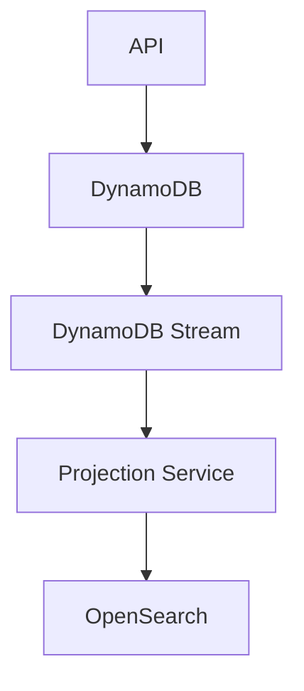

# ADR-001: Adopt CQRS with DynamoDB and OpenSearch

| | |
|---|---|
| **Status** | Accepted |

---

## Table of Contents

1. [Context](#context)
2. [Assumption](#assumption)
3. [Decision](#decision)
4. [Data Retention Strategy](#data-retention-strategy)
5. [Rationale](#rationale)
6. [Alternatives Considered](#alternatives-considered)
7. [Consequences](#consequences)
8. [Risks](#risks)
9. [Consequences for Future Design](#consequences-for-future-design)
10. [Architecture Principle Established](#architecture-principle-established)

---

## Context

The Truck Visit Management platform must support:

- Up to 20,000 truck visits per day
- Peak loads of 300 requests per second
- Near real-time operational visibility
- Flexible search and filtering capabilities
- Audit retention requirements of 7 years
- Future expansion to multiple terminals
- 99.95% availability

The primary workload is expected to be **write-heavy**, driven by:

- Visit creation
- Driver check-in activities
- Status transitions
- Audit record creation
- Smart Gate interactions

Search requirements are operational in nature and require filtering across multiple attributes, including:

- Terminal
- Current status
- Movement dates
- Creation dates
- Created by
- Vehicle identifiers
- Driver information

The query model is expected to evolve over time as additional reporting and operational requirements emerge.

---

## Assumption

The solution will process significantly more writes than searches.

Operational users typically retrieve a subset of active visits, while every visit generates multiple state transitions and audit records during its lifecycle.

---

## Decision

Adopt a **Command Query Responsibility Segregation (CQRS)** architecture.

### Command Model

**Amazon DynamoDB** will be used as the transactional write store.

Responsibilities:
- Create Visit
- Update Visit Status
- Store Visit Aggregate
- Persist Audit Records
- Act as the authoritative source of truth

### Query Model

**Amazon OpenSearch** will be used as the read-optimised query store.

Responsibilities:
- Search Visits
- Operational dashboards
- Flexible filtering
- Aggregations
- Future reporting requirements

### Read Model Projection

Data will be synchronised using an event-driven projection model.



> The OpenSearch index is a **read-only projection** and must not be treated as the system of record.

---

## Data Retention Strategy

The business requires audit and visit data to be retained for **7 years**.

To support this requirement while preventing indefinite storage growth, all visit and audit records stored in DynamoDB will include an expiration timestamp.

### Retention Rule

**Retention Period**: 7 Years

### DynamoDB TTL

A DynamoDB TTL (Time To Live) attribute will be populated when records are created.

```text
ExpiresAt = CreatedDate + 7 Years
```

Upon expiry:
- DynamoDB will automatically remove records
- Expired events will no longer be available in the transactional store
- OpenSearch projections associated with expired records will also be removed through a corresponding retention process

### Benefits

- Meets regulatory retention requirements
- Eliminates manual purge processes
- Prevents uncontrolled data growth
- Reduces long-term storage costs
- Simplifies operational maintenance

### Assumptions

The business has confirmed that:
- Records older than 7 years do not need to remain accessible
- No legal hold or extended retention requirements currently exist
- Expiry may be suspended for specific records in the future if mandated by legal or regulatory obligations

---

## Rationale

### Why DynamoDB?

DynamoDB provides:
- Extremely high write throughput
- Low latency writes
- Automatic scaling
- Multi-AZ resilience
- Managed operational model
- Flexible schema evolution

The Visit aggregate is relatively simple from a transactional perspective and aligns well with DynamoDB's access patterns.

### Why OpenSearch?

The search requirements are significantly more flexible than the write requirements.

OpenSearch provides:
- Rich filtering
- Full-text search capabilities
- Complex query combinations
- Aggregations
- Sorting
- Paging
- Operational reporting support

Attempting to satisfy these requirements directly from DynamoDB would introduce additional complexity and query limitations.

### Why CQRS?

The domain exhibits a classic CQRS characteristic:
- Simple transactional writes
- Complex and evolving query requirements

Separating the write and read models allows each datastore to be optimised for its specific purpose.

---

## Alternatives Considered

### PostgreSQL Only

| Pros | Cons |
|---|---|
| Simpler architecture | Search functionality becomes increasingly complex |
| Single datastore | Read and write workloads compete for the same resources |
| Strong transactional consistency | Scaling strategy becomes less flexible |

### DynamoDB Only

| Pros | Cons |
|---|---|
| Simplest AWS-native solution | Limited query flexibility |
| Lowest operational overhead | Complex secondary index management |
| | Difficult reporting and search experience |
| | Future search requirements likely require a dedicated search engine anyway |

### OpenSearch as Primary Database

| Pros | Cons |
|---|---|
| Rich query capabilities | Not designed to be the authoritative transactional store |
| | Weaker transactional guarantees |
| | Increased operational risk |

---

## Consequences

### Positive
- Optimised write throughput
- Optimised search experience
- Independent scaling of read and write workloads
- Future-proof query capability
- Reduced operational burden
- Automatic retention management through TTL
- Support for future reporting and analytics

### Negative
- Eventual consistency between writes and searches
- Additional projection infrastructure
- More operational components
- Additional monitoring requirements

---

## Risks

### Risk: Projection Lag

A recently created or updated Visit may not immediately appear in search results.

**Mitigation**: Define and monitor projection latency SLAs.

**Target**: < 5 seconds

### Risk: Retention Misconfiguration

Incorrect TTL values could result in premature data deletion.

**Mitigation**
- Automated testing of retention calculations
- Monitoring of record expiry rates
- Operational alerts for unexpected deletion patterns

---

## Consequences for Future Design

The following ADRs depend on this decision:

- ADR-003: Event-Driven Projection Strategy
- ADR-004: Visit Aggregate as System of Record
- ADR-005: Immutable Audit History
- ADR-006: Multi-Terminal Isolation Strategy
- ADR-008: Eventual Consistency Acceptance

---

## Architecture Principle Established

> DynamoDB is the authoritative transactional store for Truck Visit Management. OpenSearch is a searchable projection of that data. Records will be retained for seven years and automatically expired using TTL-based lifecycle management.
