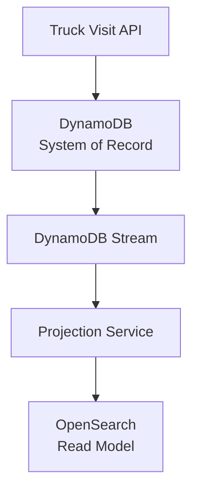
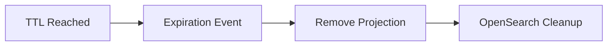
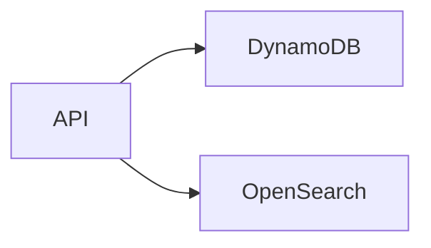
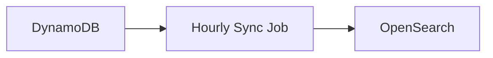

# ADR-003: Event-Driven Projection Strategy

| | |
|---|---|
| **Status** | Accepted |

---

## Table of Contents

1. [Context](#context)
2. [Decision](#decision)
3. [Rationale](#rationale)
4. [Projection Architecture](#projection-architecture)
5. [Consistency Model](#consistency-model)
6. [Failure Handling](#failure-handling)
7. [Retention Alignment](#retention-alignment)
8. [Alternatives Considered](#alternatives-considered)
9. [Operational Requirements](#operational-requirements)
10. [Consequences](#consequences)
11. [Risks](#risks)
12. [Architecture Principle Established](#architecture-principle-established)

---

## Context

The Truck Visit Management platform has adopted a CQRS architecture ([ADR-001](./adr-001-cqrs-dynamodb-opensearch.md)).

Under this architecture:

- DynamoDB is the transactional system of record.
- OpenSearch is the query-optimised read model.
- Writes and reads are independently optimised.
- Search capabilities are expected to evolve over time.
- Read traffic is expected to be lower than write traffic.

The platform must support:

- Near real-time operational visibility
- Flexible search capabilities
- Future reporting requirements
- Scalable read and write workloads
- 99.95% availability

Since read and write models are stored in different persistence technologies, a mechanism is required to keep the OpenSearch read model synchronised with changes made in DynamoDB.

---

## Decision

The solution will use an **event-driven projection architecture** to build and maintain the OpenSearch read model.

Changes committed to DynamoDB will be published through DynamoDB Streams and processed asynchronously by a projection service.

> OpenSearch will never be updated directly by API requests. All read model updates must originate from events emitted from the transactional datastore.

---

## Rationale

### Decoupling Reads from Writes

The transactional model and query model serve different purposes.

| DynamoDB is optimised for | OpenSearch is optimised for |
|---|---|
| Fast writes | Multi-field filtering |
| Aggregate persistence | Search |
| Operational simplicity | Aggregations, analytics, operational dashboards |

Separating these concerns allows each technology to be optimised independently.

### Scalability

As the number of terminals grows, write throughput and search workload are likely to grow at different rates. Event-driven projections allow:

- Independent scaling of projection processing
- Independent scaling of search infrastructure
- Independent tuning of read and write performance

...without introducing coupling between systems.

### Future Query Flexibility

Search requirements frequently evolve, for example:

- Additional filter combinations
- New reporting attributes
- Operational dashboards
- Regulatory reporting support

By projecting data into OpenSearch, new indexes and document structures can be introduced without impacting the transactional data model.

### Resilience

The write path remains available even if OpenSearch is temporarily unavailable. This is important because:

- Creating Visits
- Updating Statuses
- Recording Audit Data

...are business-critical operations. Search is important but should not prevent business transactions from being recorded.

---

## Projection Architecture

### Event Source

DynamoDB Streams will act as the source of changes. Events generated include:

- `Visit Created`
- `Visit Updated`
- `Visit Status Changed`
- `Visit Expired`

### Projection Service

The Projection Service is responsible for:

- Consuming stream events
- Transforming domain data
- Building search documents
- Updating OpenSearch indexes
- Managing projection failures

> The Projection Service contains no business logic. It exists solely to create and maintain read models.

### Search Document Example

A visit projection may contain:

- `VisitId`
- `TerminalId`
- `CurrentStatus`
- `TruckNumber`
- `TrailerNumber`
- `DriverName`
- `MovementDates`
- `CreatedBy`
- `CreatedDate`
- `LastUpdatedDate`

This structure is optimised for querying rather than transactional consistency.

---

## Consistency Model

The platform adopts an **Eventual Consistency** model.

### Business Acceptance

Immediately after a successful write, `Get By Id` must return the latest transactional state.

However, `Search` may take a short period to reflect changes.

### Target Projection SLA

The platform should target:

| Percentile | Target |
|---|---|
| 95% of projections | < 2 seconds |
| 99% of projections | < 5 seconds |

...from successful transaction commit to search availability.

### User Experience Implications

Operational users may observe:

1. Visit created
2. Search immediately performed
3. Visit not yet visible

This behaviour is expected and should be documented.

---

## Failure Handling

### Scenario

Projection processing fails due to:

- OpenSearch outage
- Network interruption
- Temporary infrastructure failure

### Behaviour

Transactional writes remain successful. The Projection Service retries processing until successful.

### Dead Letter Queue

Failed projections exceeding retry limits will be moved to a Dead Letter Queue (DLQ). This allows:

- Operational investigation
- Replay capability
- Controlled recovery

### Idempotency

Projection processing must be idempotent. Processing the same event multiple times must produce the same result.

**Example**: A `Visit Status Changed` event processed twice must not create duplicate documents.

This protects against:

- Stream retries
- Consumer restarts
- Network failures

---

## Retention Alignment

[ADR-001](./adr-001-cqrs-dynamodb-opensearch.md) establishes a seven-year retention policy. The projection strategy must honour the same lifecycle.

### Rule

When records expire from DynamoDB:

> The search index must not retain records beyond the approved retention period.

---

## Alternatives Considered

### Dual Writes

| Advantages | Disadvantages |
|---|---|
| Immediate search consistency | Increased application complexity |
| | Partial failure scenarios |
| | Inconsistent data risk |
| | Tight coupling |

**Decision**: Rejected.

### Synchronous Projection

| Advantages | Disadvantages |
|---|---|
| Stronger consistency | Slower write path |
| | Search dependency on critical transactions |
| | Reduced resilience |

**Decision**: Rejected.

### Scheduled Batch Synchronisation

| Advantages | Disadvantages |
|---|---|
| Simpler implementation | Poor operational visibility |
| | Significant data latency |
| | Fails near real-time requirements |

**Decision**: Rejected.

---

## Operational Requirements

### Monitoring

The Projection Service must expose metrics for:

- Projection Throughput
- Projection Latency
- Projection Failures
- Retry Count
- DLQ Count
- OpenSearch Indexing Latency

### Alerting

Operational alerts should be raised when:

- Projection Backlog Exceeds Threshold
- DLQ Contains Messages
- Projection Latency SLA Breached
- OpenSearch Indexing Fails

### Health Checks

Health endpoints should validate:

- DynamoDB Stream Connectivity
- OpenSearch Connectivity
- Projection Consumer Status

---

## Consequences

### Positive
- Highly scalable architecture
- Decoupled read and write models
- Resilient transaction processing
- Flexible search capabilities
- Independent optimisation of each datastore
- Supports future reporting requirements

### Negative
- Eventual consistency
- Additional infrastructure components
- Increased operational monitoring requirements
- Replay and recovery mechanisms required

---

## Risks

### Risk: Projection Backlog Growth

Large event volumes could delay search visibility.

**Mitigation**
- Horizontal scaling of projection processors
- Backlog monitoring
- Alerting on latency thresholds

### Risk: Search Model Drift

Projection failures could cause OpenSearch to diverge from DynamoDB.

**Mitigation**
- Replay capability
- Periodic reconciliation jobs
- DLQ monitoring

### Risk: Event Schema Evolution

Future model changes may break projections.

**Mitigation**
- Versioned event contracts
- Backward-compatible schema changes
- Controlled reindexing processes

---

## Architecture Principle Established

> All OpenSearch read models will be maintained asynchronously through an event-driven projection process sourced from DynamoDB Streams. DynamoDB remains the authoritative source of truth, while OpenSearch acts as a near real-time searchable projection optimised for operational queries.
