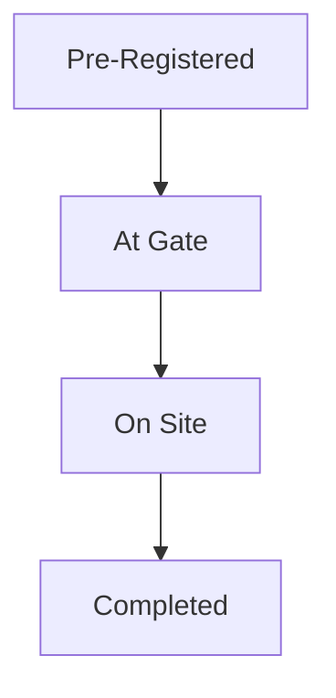

# ADR-004: Immutable Audit History

| | |
|---|---|
| **Status** | Accepted |

---

## Table of Contents

1. [Context](#context)
2. [Decision](#decision)
3. [Audit Model](#audit-model)
4. [Audit Record Structure](#audit-record-structure)
5. [Example Audit Trail](#example-audit-trail)
6. [Append-Only Principle](#append-only-principle)
7. [Rationale](#rationale)
8. [DynamoDB Storage Strategy](#dynamodb-storage-strategy)
9. [Retention Strategy](#retention-strategy)
10. [Audit Events](#audit-events)
11. [Correlation Requirements](#correlation-requirements)
12. [Search Considerations](#search-considerations)
13. [Alternatives Considered](#alternatives-considered)
14. [Risks](#risks)
15. [Consequences](#consequences)
16. [Architecture Principle Established](#architecture-principle-established)

---

## Context

The Truck Visit Management platform must satisfy the following business and operational requirements:

- Regulatory audits occur regularly
- Full audit history of status changes is required
- Audit records must be retained for 7 years
- Visit status can be updated throughout its lifecycle
- The platform must provide traceability of operational activity
- Multiple actors may interact with a Visit over time

A Visit progresses through a defined lifecycle:



Whilst the current state of a Visit may change, the business requires a permanent record of how that state was reached.

Without an immutable audit capability, the platform would be unable to reliably answer questions such as:

- When did the truck arrive?
- Who changed the status?
- What was the previous status?
- Has data been altered after the fact?
- Can the history be trusted during an audit?

A dedicated audit strategy is therefore required.

---

## Decision

All Visit status transitions shall be recorded as **immutable audit records**.

Audit records:

- Are append-only
- Cannot be modified
- Cannot be deleted before retention expiry
- Must be retained for seven years
- Must be independently queryable
- Must provide a complete lifecycle history for a Visit

Every successful status transition will generate a new audit record. Existing audit records are never updated.

---

## Audit Model

### Current State

The Visit Aggregate stores the current state of the Visit.

**Example**
```
Visit ABC123
Current Status = On Site
```

### Historical State

Historical transitions are stored as immutable audit records.

**Example**
```
1. Pre-Registered
2. At Gate
3. On Site
```

> The current status can always be derived from the last successful transition, but operational APIs are optimised by storing the current status separately.

---

## Audit Record Structure

Each audit record should contain:

- `AuditId`
- `VisitId`
- `TerminalId`
- `EventType`
- `PreviousStatus`
- `NewStatus`
- `Timestamp`
- `ActorId`
- `ActorType`
- `CorrelationId`

### Actor Types

Possible actor types include:

- Driver
- Gate Operator
- System
- Administrator
- Integration

This provides traceability regardless of who initiated the action.

---

## Example Audit Trail

| Event | Timestamp | Previous Status | New Status |
|---|---|---|---|
| `VisitCreated` | 2026-01-01T09:00:00Z | — | Pre-Registered |
| `VisitStatusChanged` | 2026-01-01T09:15:00Z | Pre-Registered | At Gate |
| `VisitStatusChanged` | 2026-01-01T09:20:00Z | At Gate | On Site |
| `VisitStatusChanged` | 2026-01-01T11:30:00Z | On Site | Completed |

---

## Append-Only Principle

Audit records are append-only.

| Permitted | Not Permitted (before retention expiry) |
|---|---|
| `INSERT` | `UPDATE` |
| | `DELETE` |

**Example**

| Allowed | Not Allowed |
|---|---|
| Record 1, Record 2, Record 3, Record 4 | Modify Record 2 |
| | Delete Record 3 |
| | Overwrite Record 1 |

> If an error occurs, a new audit record must be added to represent the correction. Historical facts must never be rewritten.

---

## Rationale

### Regulatory Compliance

The business requirement explicitly states: *"Full audit history of status changes."* Immutable records provide a verifiable audit trail.

### Trustworthiness

An audit trail can only be trusted if historical records cannot be altered. Immutability ensures:

- Accountability
- Non-repudiation
- Traceability

### Operational Investigations

Audit records support investigation of:

- Driver complaints
- Gate incidents
- Operational delays
- Status discrepancies
- Security reviews

### Architectural Simplicity

Append-only audit models are simpler to reason about than mutable audit records. Every event becomes a historical fact.

---

## DynamoDB Storage Strategy

Audit records will be stored separately from the mutable Visit Aggregate.

**Recommended structure**

```
Visits Table
PK = VisitId

CurrentStatus
Truck
Trailer
Driver
...
```

```
VisitAudit Table
PK = VisitId
SK = Timestamp
```

This enables efficient retrieval of a Visit's audit history whilst maintaining clear separation between **Current State** and **Historical Facts**.

---

## Retention Strategy

Audit data must be retained for **7 years** in accordance with operational requirements.

### TTL Policy

Each audit record will contain an `ExpiresAt` attribute, computed as:

```
ExpiresAt = CreatedAt + 7 Years
```

DynamoDB TTL will be used to automatically expire records once retention obligations have been satisfied.

> **Important**: No audit record may be removed before the retention period is complete, unless a legal or regulatory process explicitly requires otherwise.

---

## Audit Events

The following events must create audit entries.

| Category | Event |
|---|---|
| Visit Created | `VisitCreated` |
| Visit Status Changed | `VisitStatusChanged` |
| Manual Intervention | `ManualReviewPerformed` |
| Data Correction | `VisitCorrected` |
| Security-Relevant Actions | `UnauthorizedAccessAttempt`, `AccessGranted`, `AccessRevoked` (where applicable) |

---

## Correlation Requirements

Every audit event must include a correlation identifier.

**Purpose**
- Cross-service tracing
- Operational debugging
- Distributed request analysis

**Example**
```
CorrelationId: 8ee3d95b-faa2-4708-8a87-babb80136ef3
```

All audit events generated during a single workflow should share the same correlation identifier.

---

## Search Considerations

Audit records are not intended to support operational search workloads. Operational visit searches should continue to be served from **OpenSearch**.

Audit records are optimised for:

- Traceability
- Compliance
- Investigation
- Historical Review

---

## Alternatives Considered

### Option 1: Status History Embedded Within Visit Only

| Advantages | Disadvantages |
|---|---|
| Simpler data model | Difficult retention management |
| | Harder compliance reporting |
| | Limits future audit capabilities |

**Decision**: Rejected.

### Option 2: Mutable Audit Records

| Advantages | Disadvantages |
|---|---|
| None | Breaks auditability |
| | Allows historical manipulation |
| | Fails compliance objectives |

**Decision**: Rejected.

### Option 3: Database Change Logs Only

| Advantages | Disadvantages |
|---|---|
| Minimal application logic | Database-specific |
| | Difficult to query |
| | Difficult to understand from a business perspective |
| | Poor portability |

**Decision**: Rejected.

---

## Risks

### Risk: Audit Growth

Seven years of data may create large audit datasets.

**Mitigation**
- DynamoDB TTL
- Efficient partitioning strategy
- Archival review if requirements change

### Risk: Missing Audit Events

Development changes could accidentally bypass audit creation.

**Mitigation**
- Audit generation embedded within domain workflows
- Automated tests verifying audit creation
- Monitoring of audit event volumes

### Risk: Audit and Business State Divergence

Business updates succeed but audit creation fails.

**Mitigation**: Audit record creation must be treated as part of the successful transaction workflow. A state change is not complete until the corresponding audit record has been created.

---

## Consequences

### Positive
- Meets regulatory requirements
- Complete lifecycle traceability
- Supports investigations
- Provides trusted historical records
- Supports future reporting and analytics
- Clear separation between current state and audit history

### Negative
- Increased storage consumption
- Additional write operations
- Additional monitoring requirements

---

## Architecture Principle Established

> All Visit status transitions and auditable business actions shall be recorded as immutable, append-only audit records. Historical events are considered permanent business facts and must not be modified or deleted during the mandated seven-year retention period.
