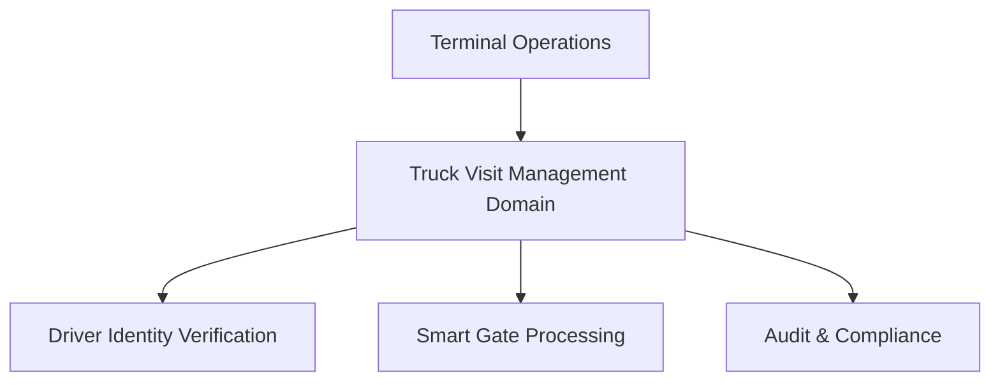
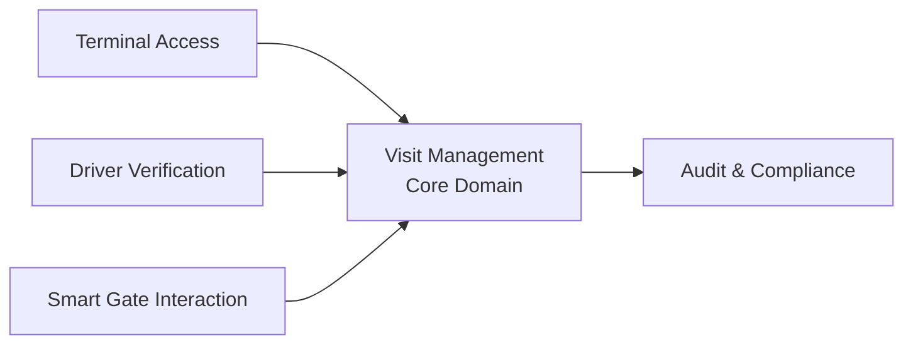

# Bounded Context Definition — Truck Visit Management Domain

| | |
|---|---|
| **Version** | 1.0 |
| **Status** | Draft |
| **Document Type** | Domain-Driven Design (DDD) |
| **Audience** | Product Owners, Architects, Developers, Business Analysts, QA Engineers |

---

## Table of Contents

1. [Purpose](#1-purpose)
2. [Context Definition Approach](#2-context-definition-approach)
3. [Domain Landscape](#3-domain-landscape)
4. [Identified Bounded Contexts](#4-identified-bounded-contexts)
5. [Context Relationships](#5-context-relationships)
6. [Context Ownership Matrix](#6-context-ownership-matrix)
7. [Strategic Context Classification](#7-strategic-context-classification)
8. [Recommended Initial Implementation](#8-recommended-initial-implementation)
9. [Anti-Corruption Principles](#9-anti-corruption-principles)
10. [Future Evolution Roadmap](#10-future-evolution-roadmap)
11. [Architectural Decisions Captured](#architectural-decisions-captured)

---

## 1. Purpose

This document defines the bounded contexts within the Truck Visit Management domain and the relationships between them.

The objective is to:

- Establish clear ownership boundaries
- Minimise coupling
- Define responsibility for business capabilities
- Enable future expansion without architectural redesign
- Create alignment between business domains and software architecture

---

## 2. Context Definition Approach

When identifying bounded contexts, the following principles have been applied:

| Principle | Description |
|---|---|
| **Business Capability Alignment** | A bounded context should map to a distinct business capability. |
| **High Cohesion** | Concepts that frequently change together should exist within the same context. |
| **Low Coupling** | Contexts should depend on each other through well-defined contracts. |
| **Future Scalability** | The design must support future terminal expansion and potential system decomposition. |

---

## 3. Domain Landscape

The Truck Visit Management solution operates within a broader Smart Gate ecosystem.



---

## 4. Identified Bounded Contexts

The following contexts have been identified.

### 4.1 Visit Management Context

**Classification**: Core Domain — this is the primary business domain.

**Purpose**
Manage the lifecycle of truck visits from registration through completion.

**Responsibilities**
- Create Visit
- Store Visit
- Search Visit
- Update Visit Status
- Maintain Visit Lifecycle
- Manage Collections
- Manage Deliveries
- Manage Truck Information
- Manage Trailer Information
- Manage Driver References

**Owns**

| Category | Items |
|---|---|
| Entities | `Visit`, `Truck`, `Trailer`, `DriverReference`, `Collection`, `Delivery` |
| Value Objects | `TerminalId`, `LicensePlate`, `TruckUnitNumber`, `TrailerNumber`, `VisitId` |
| Business Rules | Status transitions, Vehicle normalization, Terminal ownership, Visit lifecycle validation |

**Ubiquitous Language (terms owned by this context)**
`Visit` · `Movement` · `Collection` · `Delivery` · `Truck` · `Trailer` · `Status` · `Check-In` · `Check-Out`

**Why It Exists**
This is the reason the system exists. Without Visit Management there is no business capability.

---

### 4.2 Driver Verification Context

**Classification**: Supporting Domain

**Purpose**
Verify that a Driver is authorised and identifiable.

**Responsibilities**
- Validate identity
- Verify credentials
- Maintain driver verification outcome
- Record verification events

**Owns**

| Category | Items |
|---|---|
| Entities | `Driver Identity`, `Verification Result`, `Verification Session` |

**Ubiquitous Language (terms owned)**
`Driver Identity` · `Verification` · `Identity Document` · `Verification Outcome`

**Notes**
The Visit Management context should not contain identity verification logic. Instead:

1. Visit Management requests verification
2. Driver Verification returns outcome

This reduces complexity and supports future integration with external identity providers.

---

### 4.3 Terminal Access Context

**Classification**: Supporting Domain

**Purpose**
Control who can access terminal data.

**Responsibilities**
- Terminal permissions
- Terminal membership
- Claims interpretation
- Authorization decisions

**Owns**

| Category | Items |
|---|---|
| Concepts | `Terminal Access`, `Permission`, `Role`, `Authorization Policy` |

**Business Rules**
- Users can only access authorised terminals.
- Users cannot retrieve visits from unauthorised terminals.

**Ubiquitous Language (terms owned)**
`Terminal Access` · `Authorization` · `Permission` · `Role`

**Notes**
This keeps security concerns separate from operational concerns.

---

### 4.4 Audit & Compliance Context

**Classification**: Generic Supporting Domain

**Purpose**
Provide immutable historical records.

**Responsibilities**
- Status history
- Audit storage
- Audit retrieval
- Compliance reporting support

**Owns**

| Category | Items |
|---|---|
| Entities | `Audit Record`, `Audit Trail`, `Status History` |

**Business Rules**
- Audit records are immutable.
- Audit records cannot be deleted before retention expiry.

**Ubiquitous Language (terms owned)**
`Audit Record` · `Audit Trail` · `Status History` · `Retention`

**Notes**
The source of truth for the current visit state remains Visit Management. The Audit context owns historical facts.

---

### 4.5 Smart Gate Interaction Context

**Classification**: Supporting Domain

**Purpose**
Manage interactions between automated gate systems and drivers.

**Key Assumption**
The terminal gate is unmanned and automated. Drivers interact directly with Smart Gate systems.

**Responsibilities**
- Driver sessions
- Gate workflows
- Guided user journeys
- Device interaction
- Exception routing

**Owns**

| Category | Items |
|---|---|
| Entities | `Gate Session`, `Driver Session`, `Interaction Workflow`, `Exception Case` |

**Ubiquitous Language (terms owned)**
`Session` · `Check-In Journey` · `Check-Out Journey` · `Exception` · `Assisted Processing`

**Notes**
This context exists because the business has explicitly chosen an automation-first operating model. Without this context, Visit Management would become tightly coupled to gate workflow behaviour.

---

## 5. Context Relationships



---

## 6. Context Ownership Matrix

| Capability | Context Owner |
|---|---|
| Visit lifecycle | Visit Management |
| Collections | Visit Management |
| Deliveries | Visit Management |
| Truck details | Visit Management |
| Trailer details | Visit Management |
| Driver identity verification | Driver Verification |
| Terminal permissions | Terminal Access |
| Audit history | Audit & Compliance |
| Driver check-in workflows | Smart Gate Interaction |
| Driver check-out workflows | Smart Gate Interaction |
| Exception handling | Smart Gate Interaction |

---

## 7. Strategic Context Classification

### Core Domain
- **Visit Management** — Competitive advantage exists here. This receives the highest engineering investment.

### Supporting Domains
- Driver Verification
- Terminal Access
- Smart Gate Interaction

These support operational workflows.

### Generic Domains
- Audit & Compliance
- Authentication Provider
- Observability Platform

These are necessary but not unique business differentiators.

---

## 8. Recommended Initial Implementation

Although multiple bounded contexts exist conceptually, the first implementation should remain a single deployable solution.

**Recommended Structure**

```
TruckVisitManagement
├── VisitManagement
├── DriverVerification
├── TerminalAccess
├── AuditCompliance
├── SmartGateInteraction
└── SharedKernel
```

### Why Not Microservices?

Current requirements:
- 20,000 visits per day
- 300 requests per second

...do not justify the operational complexity associated with distributed systems.

> Bounded Contexts define business ownership. They do not automatically imply separate deployments.

---

## 9. Anti-Corruption Principles

External systems must not directly influence the internal domain model.

Adapters should be created for:

- Identity Providers
- ANPR Systems
- Gate Hardware
- Terminal Operating Systems
- Future ERP Systems

This protects the domain model from external changes.

---

## 10. Future Evolution Roadmap

If future scale or organisational boundaries require decomposition:

| Order | Candidate | Rationale |
|---|---|---|
| **1st** | Audit & Compliance | Low coupling and independently scalable. |
| **2nd** | Driver Verification | Can be outsourced to external providers. |
| **3rd** | Smart Gate Interaction | May evolve into a dedicated kiosk/device platform. |
| **Last** | Visit Management | Remains the core domain and system of record. |

---

## Architectural Decisions Captured

| ID | Decision |
|---|---|
| **BC-001** | Visit Management is the Core Domain and owns the Visit lifecycle. |
| **BC-002** | Driver identity verification is separated from Visit Management. |
| **BC-003** | Audit history is treated as a distinct bounded context. |
| **BC-004** | Terminal authorization is separated from business processing. |
| **BC-005** | Smart Gate interaction is modelled as a dedicated bounded context due to the automation-first operating model. |
| **BC-006** | Bounded contexts will initially be implemented within a modular monolith and only separated into independent services if justified by future business or scaling requirements. |
